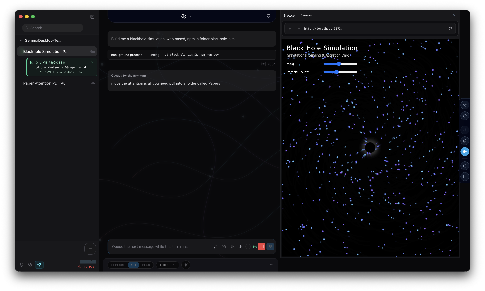
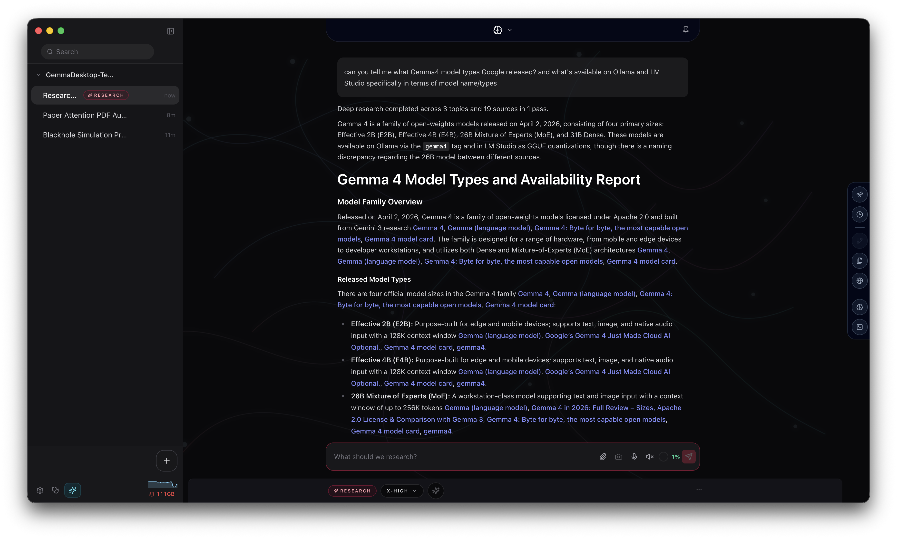

# Gemma Desktop

**A local-first desktop workbench for open models.** Run them like real software, not like a hidden chatbox: with eyes on the browser, hands on your files, voice in, voice out, and a UI that exposes the rough edges of local inference instead of pretending they aren't there.

Gemma 4 is the guided first-class path. Other open models work too, through Ollama, LM Studio, and llama.cpp.

> **Status: alpha.** This is an unaffiliated **fan project**. It is **not** built by, endorsed by, or affiliated with the Gemma team or Google. No warranties, no license granted by this repository. See [Alpha & Safety](#alpha--safety) before running it on anything you care about.

## Why this exists

Open models are getting good fast — but the path from "Ollama is running" to "I shipped real software with this" is still full of loose wiring. Runtime quirks, capability mismatches, context windows, quantization tradeoffs, multimodal support that varies by model, tool-use that breaks differently on every backend.

Gemma Desktop is a place to push on that. It's a sandbox for ambitious local-AI UX experiments — voice-driven assistants, collaborative browsers, project-aware coders, multimodal researchers — built on a real SDK, with the rough edges visible enough that you can design *around* them instead of through them.

It's a fan project, built for people who want to test fun and serious UX ideas on top of open models, especially Gemma — and have a polished surface to do it in.

---

## What's inside

A desktop app. A real one. Not a chat textbox dressed up as software.

- **Assistant Home** with a nebula welcome surface, mode toggles, and a model picker that knows what the model can actually do
- **Work mode** for project-anchored coding, browsing, and building — sessions that live with the codebase, not above it
- **Global Chat** for fast questions, planning, and model exploration — same model stack, no project required
- **CoBrowse** — the model and the human take turns driving a real visible browser
- **Project Browser** — embedded Electron browser you can watch the model navigate, take control of mid-task, and hand back
- **Voice in** with local microphone speech-to-text and a dedicated talk surface
- **Voice out** with offline neural TTS and optional spoken assistant narration
- **Multimodal attachments** — images, screenshots, camera capture, PDFs (with page rendering and batching), audio, video keyframes
- **Plan / Build / Explore modes** — the model can plan before it touches anything, build with verification, or stay read-only
- **Research workflows** — structured planning → discovery → synthesis with parallel topic workers
- **Skills + MCP** — drop-in capability extensions, Chrome DevTools integration, custom tool servers
- **Memory** — durable user facts the model remembers across sessions
- **Automations** — schedule prompts to run on intervals or fire-and-forget
- **Doctor panel** — see which models are loaded, which permissions are live, and what the runtime is actually doing
- **Menu bar popup** — quick access to Global Chat without bringing up the main window
- **Headless CLI** — every SDK-backed behavior is testable from a terminal, no Electron required

The rest of this README walks through each of these.

---

## The welcome experience


First launch drops you into **Assistant Home** with the Nebula welcome surface — an animated ambient backdrop that doubles as the model's default canvas. From here you can:

- Pick a Gemma model to start with (memory-aware default)
- Toggle into **Work mode**, **CoBrowse**, or pin to the dock for menu-bar use
- Turn on **assistant narration** if you want spoken commentary while the model works
- Walk through a startup risk dialog that's blunt about what alpha software can and can't promise

If Ollama isn't running yet, the bootstrap layer pulls the default model and warms a small helper for auxiliary tasks (titles, summaries, narration) before handing you the keys.

---

## Two ways to use it



**Work mode** binds a session to a working directory. The model can list trees, read files, search text, edit surgically, run commands, watch a build pass, and keep its history pinned to that project. Each project has its own `.gemma/session-state` — your sessions stay where the work lives.

**Global Chat** is the floating assistant. Same models, same tools, no project anchor. Use it for one-shot questions, brainstorming, model comparison, or anything that doesn't belong to a codebase. It's accessible from the menu bar popup so you don't have to bring up the full app.

Sessions are organized in a left sidebar with pinning, drag-to-reorder, project grouping, and follow-up sessions (research subtasks bubble up as nested sessions you can revisit).

---

## CoBrowse — browse the web together

The web is messy. Logins, CAPTCHAs, dynamic JS, pages that won't load without scrolling — most agent browsers fail here, and the human can't tell why.

**CoBrowse** is a different model: the agent and the human share one real browser. The Project Browser is an embedded Chromium surface you can watch the model use, click into when it gets stuck, and hand back. When the agent needs you, it stops and tells you why ("Agent needs you to complete a browser-side action"). When you're done, it picks up where it left off.

Underneath, it uses the Chrome DevTools MCP for navigation, DOM snapshots, screenshots, console capture, network inspection, click/fill/type, and JavaScript evaluation. Mutating actions can require approval. Outside CoBrowse, the same `search_web` tool routes to grounded Gemini search instead — the agent never gets to choose between two web paths in the same turn.

---

## Voice in

Hold-to-talk. Speak, watch the transcript form, send. The microphone path runs **local speech-to-text** through a managed runtime (whisper.cpp-compatible on supported builds), so your audio doesn't leave the machine.

There's a dedicated **Talk panel** with its own transcript view, a slim **Talk overlay** when you want a minimal indicator while the model speaks back, and a composer-level mic toggle for inline dictation in any conversation.

## Voice out

**Read Aloud** turns assistant messages into speech using a local **Kokoro** ONNX model — fully offline once cached. Multiple voices, adjustable speed (0.5×–2×), and a playback overlay with scrub controls.

Optional **Assistant Narration** layers brief spoken commentary on what the model is doing — "looking at the README", "about to run the build" — generated by a small helper model so it stays cheap and natural. Toggle it on for hands-free work, off when you want quiet.

---

## Files, PDFs, images, audio, video

The file surface is one of the things this app cares most about getting right.

- **Project files** — left-sidebar tree, search, file preview with syntax highlighting, recent files, drag into the composer
- **Files the model creates** — surfaced inline as diffs, with line-by-line changes and a clickable path; nothing is written to disk silently
- **PDFs** — semantic text extraction, per-page rendering for vision models, batching for long documents (up to ~12 batches × ~48 MB), page count and metadata
- **Images** — drag-and-drop, screenshot capture (macOS native), camera capture modal, screen-recording permission checked through the Doctor panel
- **Video** — sampled keyframes turned into image sequences for vision models
- **Audio files** — attach `.wav`, `.mp3`, `.m4a`, `.aac`, `.flac` to audio-capable models (Gemma 4 E2B/E4B today)

Capability detection is per-model and per-runtime: the picker tells you which model accepts which input, and the composer disables paths the active model can't actually use.

---

## Tools — the agent surface

The model has a real toolset, not a single function. Every tool is defined in the SDK, exposed through the same interface to the desktop app and the CLI, and observable via the trace panel.

**Direct tools** (immediate, single-action):

- `list_tree`, `search_paths`, `search_text`, `read_file`, `read_files` — workspace navigation
- `write_file`, `edit_file` — surgical edits with line-range diffs and read-back verification
- `exec_command` — shell execution in the working directory, gated by per-mode policy
- `fetch_url`, `fetch_url_safe` — direct page reads for known readable URLs
- `search_web` — grounded Gemini search outside CoBrowse, real Google in the visible browser inside CoBrowse
- `browser`, `chrome_devtools` — managed browser interaction, DOM/console/network inspection, JavaScript evaluation
- `materialize_content`, `read_content`, `search_content` — work with generated artifacts before they hit disk

**Delegated agents** (child sessions with their own context):

- **Research agent** — planning → discovery → synthesis with parallel topic workers
- **Planning agent** — structured plan generation
- **Topic workers** — per-topic dossier writers in research flows

Each tool call shows up inline in the chat with arguments, results, and a status tone. Mutations route through an approval card when the policy demands it. The whole thing is inspectable, cancellable, and replayable.

---

## Plan, Build, Explore

The model has modes, and the modes change what it can do.

- **Explore** — read-only investigation. Search, browse, read, summarize. No writes, no commands.
- **Plan** — generates a structured plan with rationale, considerations, and clarifying questions. No execution. The plan card lets you approve, revise, discard, or kick it into a fresh build session.
- **Build** — full mutation surface with verification. The model has to declare completion through `finalize_build` or pass the heuristic check; you can also run it in deterministic mode where only an explicit finalization counts.
- **Assistant** — full conversational mode with all tools available; the default for general work.
- **Cowork** — browser-first session that locks the agent into the visible Project Browser surface.

Each mode has its own prompt profile, tool policy, and approval rules. Switching modes mid-session is a deliberate UI action — the model can't escalate itself.

---

## Research



For anything bigger than a one-shot search, there's a structured **Research** flow:

1. **Planning** — the planner breaks the question into topics, search queries, objectives, and risks
2. **Discovery** — parallel web search, parallel URL fetches, parallel workspace reads; sources scored, deduplicated, classified by page role
3. **Synthesis** — per-topic worker agents produce dossiers (findings, contradictions, open questions, confidence); a final report stitches them together

Two profiles ship: **quick** (2 passes, 8 sources, 3 domains) and **deep** (3 passes, 18 sources, 5 domains). Everything is cancellable and persisted to `.gemma/research/` as plan + sources + dossiers + final report — readable artifacts, not opaque chains.

---

## Skills, MCP, and extension points

Gemma Desktop is built to be extended.

- **Skills** — drop a folder into your local skills directory and it becomes an installable capability with frontmatter metadata, activation IDs, and bundled tools. Up to 16 files per skill, ~90 KB content. Skills are user-curated; agents don't add or remove them on your behalf.
- **MCP servers** — Chrome DevTools MCP ships in the box for live Chrome automation. Other MCP servers can plug in through the same interface.
- **Built-in session tools** — Chrome DevTools (Build mode, with debugging port enabled), Ask Gemini (local Gemini CLI integration), each with their own description, icon, and instructions.

The SDK exposes a clean tool registry so anything you build is observable, cancellable, and traceable through the same panels everything else uses.

---

## Memory

The model can remember things across sessions. Tell it to remember something, and the helper model distills it into a concise third-person fact and appends it to a `memory.md` file in the app's userData directory.

Memory is **passive context**, not instructions — it informs the model without trying to override your current request. There's a Memory panel in the app for editing, removing, or auditing what's stored. It's plain markdown; you can open it in any editor.

---

## Automations

Schedule a prompt to run on its own. Pick the model, runtime, work mode, and working directory, then either fire it once at a specific time or on a recurring interval (minutes, hours, days). Enable, disable, or run on demand. Execution history is tracked.

Useful for daily reports, repeated research checks, or anything you'd otherwise paste into a chat at 9 AM.

---

## Doctor

Local AI breaks in interesting ways. The **Doctor panel** is built to make those breakages legible:

- Node, npm, npx availability and versions
- Ollama, LM Studio, llama.cpp status, version, and reachable endpoints
- Installed models, loaded models, parameter counts, quantization, context lengths
- macOS permissions: camera, microphone, screen recording
- Memory and GPU info, memory pressure
- Diagnoses for common failure modes with suggested fixes

Run it before you blame the model.

---

## Sessions, sidebar, right dock

The layout is deliberate.

- **Left sidebar** — projects, sessions, pins, follow-up sessions, drag-to-reorder, full-text session search
- **Chat canvas** — markdown rendering with code blocks, syntax highlighting, file diffs, tool call blocks, shell session replay, thinking blocks (for models that expose reasoning), and inline previews
- **Right dock** — collapsible panels: Files workspace (tree, preview, search), Git (read-only diff/branch/status), terminal drawer, research progress, debug panel, context gauge, memory status
- **Status bar** — live activity indicator, context window gauge, memory pressure indicator, conversation process strip
- **Menu bar popup** — quick model switch and Global Chat without opening the main window

The point is that the model isn't somewhere else — it's working in the same UI you're inspecting.

---

## Built-in Gemma 4 catalog

The guided model catalog. These are the models the picker knows how to present clearly, with capability badges, defaults, and architecture notes:

| Model | Tag | Tier | Architecture | Context | Capabilities |
| --- | --- | --- | --- | --- | --- |
| Gemma 4 E2B | `gemma4:e2b` | Low | Edge | 128K | Text, Vision, Audio, Thinking, Tools |
| Gemma 4 E4B | `gemma4:e4b` | Medium | Edge | 128K | Text, Vision, Audio, Thinking, Tools |
| Gemma 4 26B | `gemma4:26b` | High | MoE | 256K | Text, Vision, Thinking, Tools |
| Gemma 4 31B | `gemma4:31b` | Extra High | Dense | 256K | Text, Vision, Thinking, Tools |

Defaults are memory-aware:

- **`gemma4:26b`** — primary on most machines
- **`gemma4:31b`** — primary on machines with enough RAM headroom
- **`gemma4:e2b`** — helper model for cheap auxiliary work (titles, narration, summarization)

The catalog isn't a wall around Gemma. It's a clearly-marked starting path that keeps the rest of the open-model ecosystem available through runtime discovery.

---

## Supported inference stacks

Gemma Desktop is built around runtime adapters and capability inspection — not a single hardcoded API.

- **Ollama (native)** — the default path. Guided Gemma catalog, native chat, configurable context, temperature, top_p/top_k, seed, per-model profiles.
- **Ollama (OpenAI-compatible)** — the same engine through the OpenAI-compatible endpoint, useful for comparing native vs compatibility behavior.
- **LM Studio** — model discovery, request options, compatible API.
- **llama.cpp servers** — server-style integrations, with router-aware load/unload behavior where the runtime exposes it.

Non-Gemma models work as long as the runtime exposes enough of the underlying capability surface (vision, audio, tool use, context length). When a model doesn't support something, the UI says so instead of pretending.

---

## Open-source foundations

This app is only possible because of the open-source ecosystem around it:

- **Ollama**, **LM Studio**, **llama.cpp** for local model serving
- **whisper.cpp**-compatible runtimes for local speech-to-text
- **Kokoro** voices (onnx-community/kokoro-v0_19) for local read-aloud
- **PDF.js**-style page rendering and embedded text extraction
- **Electron**, **React**, **Vite**, **TypeScript**, **Node** for the desktop shell
- **Model Context Protocol (MCP)** for extensible tool servers and Chrome DevTools integration

The product idea is simple: make this stack legible from inside the interface, so developers can see which model, runtime, capability, and tool path is actually doing the work — and decide what to build with it.

---

## Repository layout

```
GemmaDesktopSDK/   The SDK. Sessions, runtime adapters, tool execution, prompts,
                   attachments, tracing, capabilities — the contracts the rest
                   of the system depends on.

GemmaDesktopApp/   The Electron + React desktop app. Proves the SDK can power
                   a polished end-user experience.

gemmadesktop-cli/  The headless parity harness. Same SDK, same behavior,
                   testable from a terminal — no Electron required.
```

The SDK is the foundation. The app and the CLI are both consumers of it, and any SDK-backed behavior is expected to land on both surfaces in lockstep.

---

## Getting started

This is a source-first alpha aimed at developers comfortable in a terminal.

**Prerequisites:**

- Node.js and npm
- macOS (primary supported platform)
- A local model runtime — **Ollama is the default**

Pull the default model:

```bash
ollama pull gemma4:26b
```

Install dependencies:

```bash
npm install
```

Run the desktop app in development:

```bash
npm run dev
```

From there, the in-app settings let you swap runtimes, install other Gemma sizes, point at LM Studio or llama.cpp, configure tools, and inspect what's actually loaded through the Doctor panel.

---

## Alpha & safety

This is experimental software. Read this before running it on anything you care about.

- **No warranties.** Output can be wrong, incomplete, unsafe, or inconsistent.
- **No license** is granted by this repository unless one is added later.
- **Local tools can read and modify files** when enabled. The agent runs commands in your working directory.
- **Web pages, PDFs, images, files, and audio** can carry prompt-injection content. Treat untrusted inputs accordingly.
- **Local runtimes can stall, crash, stream malformed output**, or behave differently across versions. Loading multiple large models simultaneously can destabilize the machine.
- **You are responsible** for what you run, which models you install, and which files or websites you expose to the app.

Use it as a lab for open-model product work — not as a polished hosted assistant.

---

## Affiliation

Gemma Desktop is an **independent fan project**. It is **not** built by, endorsed by, sponsored by, or affiliated with the Gemma team, Google, Google DeepMind, Ollama, LM Studio, or any other vendor mentioned in this README. "Gemma" is a trademark of its respective owner; this project uses the name only to describe which model family it's primarily built around.

If you're here to push on what open models can do — welcome. Have fun.
